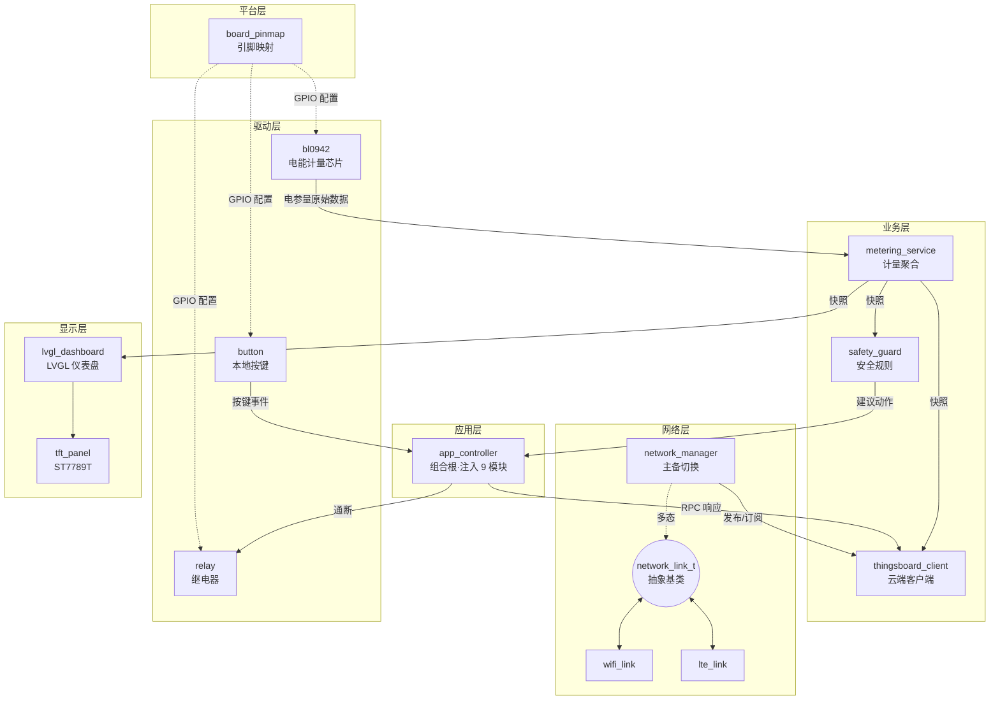
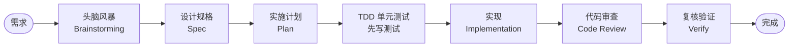
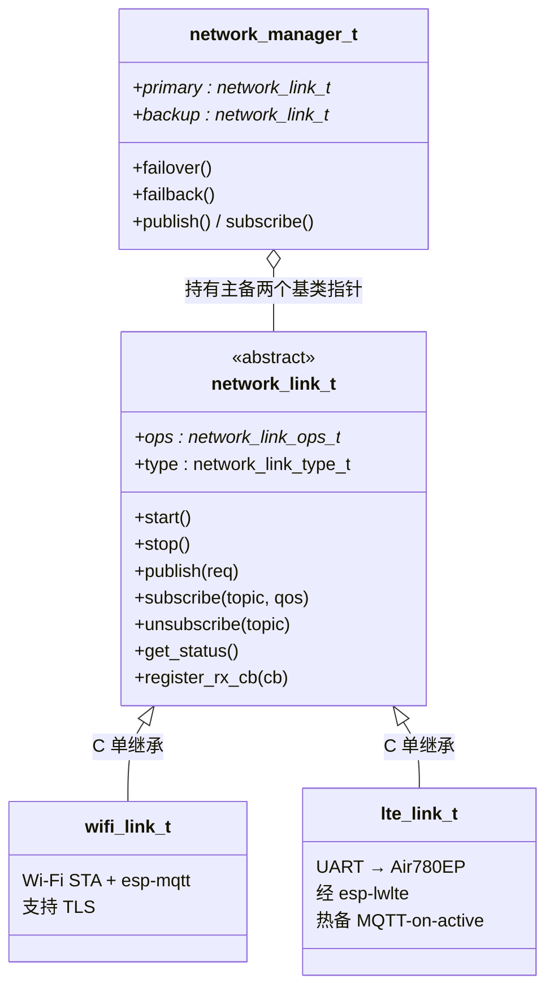
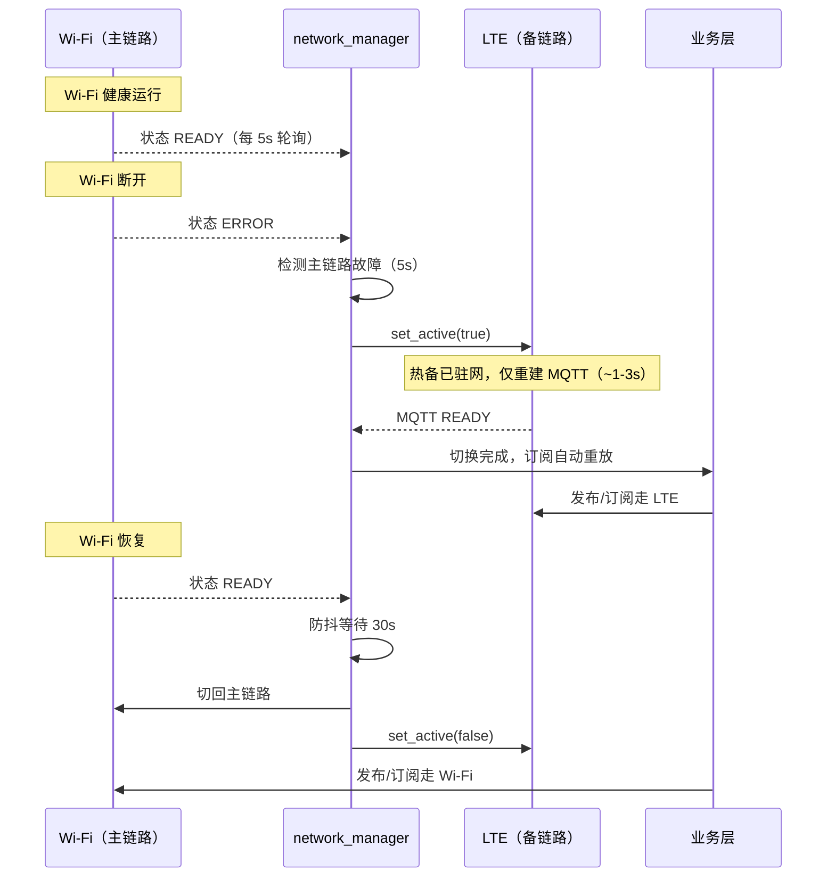

# GitHub README 实施计划

> **For agentic workers:** REQUIRED SUB-SKILL: Use superpowers:subagent-driven-development (recommended) or superpowers:executing-plans to implement this plan task-by-task. Steps use checkbox (`- [ ]`) syntax for tracking.

**Goal:** 为 `dual-link-smart-socket` 仓库编写中文 GitHub README + MIT LICENSE，面向求职面试官，以倒金字塔结构呈现 AI 驱动工程工作流与双模联网 OOP 架构。

**Architecture:** 两个交付物——仓库根目录 `README.md`（11 节，Mermaid 图 + 表格构建视觉层次）和 `LICENSE`（MIT）。README 按 spec 的倒金字塔结构从文件头逐步构建。

**Tech Stack:** Markdown / Mermaid（GitHub 原生渲染）/ shields.io 静态徽章。

**关联设计文档:** `docs/superpowers/specs/2026-07-11-readme-design.md`

**提交策略:** 用户 AGENTS.md 规定未经明确许可不得提交。本计划在每个任务末尾标注 commit 步骤，但执行时必须先获得用户授权才可提交。

---

## 文件结构

| 文件 | 操作 | 职责 |
|------|------|------|
| `LICENSE` | 新建 | MIT 许可证全文，版权人 ZhouDreams，2026 |
| `README.md` | 新建 | 仓库根目录中文 README，11 节 |

---

### Task 1: 创建 LICENSE 文件

**Files:**
- Create: `LICENSE`

- [ ] **Step 1: 写入 MIT LICENSE 全文**

文件 `LICENSE` 完整内容：

```
MIT License

Copyright (c) 2026 ZhouDreams

Permission is hereby granted, free of charge, to any person obtaining a copy
of this software and associated documentation files (the "Software"), to deal
in the Software without restriction, including without limitation the rights
to use, copy, modify, merge, publish, distribute, sublicense, and/or sell
copies of the Software, and to permit persons to whom the Software is
furnished to do so, subject to the following conditions:

The above copyright notice and this permission notice shall be included in all
copies or substantial portions of the Software.

THE SOFTWARE IS PROVIDED "AS IS", WITHOUT WARRANTY OF ANY KIND, EXPRESS OR
IMPLIED, INCLUDING BUT NOT LIMITED TO THE WARRANTIES OF MERCHANTABILITY,
FITNESS FOR A PARTICULAR PURPOSE AND NONINFRINGEMENT. IN NO EVENT SHALL THE
AUTHORS OR COPYRIGHT HOLDERS BE LIABLE FOR ANY CLAIM, DAMAGES OR OTHER
LIABILITY, WHETHER IN AN ACTION OF CONTRACT, TORT OR OTHERWISE, ARISING FROM,
OUT OF OR IN CONNECTION WITH THE SOFTWARE OR THE USE OR OTHER DEALINGS IN THE
SOFTWARE.
```

- [ ] **Step 2: 验证 LICENSE 格式**

确认文件以 `MIT License` 开头，GitHub 会自动识别并在仓库页右侧显示 "MIT License" 标签。

---

### Task 2: 创建 README 英雄区 + 核心亮点（节 ①②）

**Files:**
- Create: `README.md`

- [ ] **Step 1: 写入英雄区 + 亮点卡片**

`README.md` 完整内容（本任务写入节 ①②）：

```markdown
# dual-link-smart-socket

> 基于 ESP32-S3 的双模联网智能插座系统 —— 全程以 AI 驱动的工程工作流开发

[]()
[]()
[-lightgrey)]()
[]()
[]()
[]()
[]()
[](LICENSE)

基于 ESP32-S3 的双模联网（Wi-Fi + LTE）智能插座系统。14 个模块、23 个源文件，
覆盖从底层驱动到云端集成的完整 IoT 能力栈。全程采用 AI 驱动的工程工作流开发，
留有 6 份设计规格、7 份实施计划、28 份代码审查报告。

---

## 核心亮点

### AI 驱动的工程工作流

不是"AI 写代码、我复制"，而是用 AI 跑通**设计规格 → 实施计划 → 单元测试 → 代码审查**
的完整工程闭环，每个决策与产出都在仓库留痕、可回查。

### 双模联网 + C OOP 架构

Wi-Fi / LTE 热备份，主链路故障自动切换到 LTE（MQTT 重建 ~1-3s），主链路恢复后自动回切。
用 C 语言继承与多态（vtable）实现统一网络抽象，上层不感知当前是 Wi-Fi 还是 LTE。

### 工程化 / 代码质量

14 个模块逐个代码审查 + 复核验证，主机端单元测试隔离纯逻辑层，配套错误处理规范与编码风格指南。

### 云端 + 显示全栈集成

ThingsBoard RPC 远程控制 / 遥测上报（MQTT over TLS），LVGL 本地仪表盘实时显示电参量。
```

- [ ] **Step 2: 在 GitHub 预览渲染**

确认徽章全部正常显示、引用块（`>`）正确渲染、无图片裂开。

---

### Task 3: 系统架构图 + 模块全景表（节 ③④）

**Files:**
- Modify: `README.md`（追加）

- [ ] **Step 1: 追加架构图与模块表**

在 `README.md` 末尾追加：

````markdown

---

## 系统架构



---

## 模块全景

| 模块 | 目录 | 职责 | 关键句柄 |
|------|------|------|----------|
| 应用编排 | `main/app` | 组合根，注入 9 个模块句柄，协调启动顺序与数据流 | `app_controller_t` |
| 电能计量芯片 | `main/bl0942` | BL0942 UART 驱动，采集电压/电流/功率/电能 | `bl0942_t` |
| 计量服务 | `main/metering` | 寄存器值转工程单位，窗口聚合，电能增量确认/丢弃协议 | `metering_service_t` |
| 安全保护 | `main/safety` | 过流/过功率规则，持久采样去抖，输出三级告警 | `safety_guard_t` |
| 继电器 | `main/relay` | 通断控制，状态变更打来源标签防云端回声 | `relay_t` |
| 按键 | `main/button` | GPIO 输入，单击/双击/长按检测 | `button_t` |
| 网络链路基类 | `main/network` | 抽象基类，定义 vtable（start/stop/publish/subscribe…） | `network_link_t` |
| Wi-Fi 链路 | `main/network/wifi` | 子类：Wi-Fi STA + esp-mqtt，支持 TLS | `network_link_t*` |
| LTE 链路 | `main/network/lte` | 子类：UART→Air780EP，经 esp-lwlte | `network_link_t*` |
| 网络管理器 | `main/network` | 主备选择 + 故障切换/回切 + 订阅意图重放 | `network_manager_t` |
| ThingsBoard | `main/thingsboard` | 遥测 JSON / RPC 解析 / 属性上报 | `thingsboard_client_t` |
| LVGL 仪表盘 | `main/display/lvgl` | 独立 LVGL 任务，构建控件树，周期刷新 | `lvgl_dashboard_t` |
| TFT 面板 | `main/display/tft` | ST7789T SPI 驱动（172×320） | `tft_panel_t` |
| 引脚映射 | `main/platform` | 只读单例，返回全部 GPIO 分配 | `board_pinmap_t` |
````

- [ ] **Step 2: 验证 Mermaid 渲染**

在 GitHub 仓库页确认 `mermaid` 代码块正确渲染为流程图，5 个 subgraph 分层清晰，箭头方向正确。

---

### Task 4: AI 工程工作流深入（节 ⑤）

**Files:**
- Modify: `README.md`（追加）

- [ ] **Step 1: 追加 AI 工作流章节**

````markdown

---

## 深入：AI 驱动的工程工作流

本项目全程采用结构化的 AI 协作流程。核心原则：**人主导设计决策，AI 执行与验证；AI 不绕过任何质量门。**



每个阶段的产出物都存档在仓库内，可追溯、可回查：

| 工作流阶段 | 产出物 | 仓库位置 | 数量 |
|-----------|--------|---------|------|
| 头脑风暴 + 设计规格 | 模块设计文档 | `docs/superpowers/specs/` | 6 份 |
| 实施计划 | 逐步实施文档 | `docs/superpowers/plans/` | 7 份 |
| 代码审查 | 模块审查报告 | `docs/agents/code-review/report-*.md` | 14 份 |
| 审查复核 | 修复验证报告 | `docs/agents/code-review/verify-*.md` | 14 份 |
| 单元测试 | 主机端测试套 | `test/host/` | 5 套 |
| AI 协作规范 | 编码风格/OOP/错误处理/审查清单 | `docs/agents/` | 7 篇 |

这套方法确保：架构决策与模块边界由人定义，AI 负责执行、生成测试、发现问题；每段代码都经过
规格→计划→测试→审查四道关卡，而非一次性生成。
````

- [ ] **Step 2: 验证 Mermaid 流程图渲染 + 表格对齐**

---

### Task 5: 双模联网 OOP 设计深入（节 ⑥）

**Files:**
- Modify: `README.md`（追加）

- [ ] **Step 1: 追加双模 OOP 章节（类图 + 时序图 + 参数表）**

````markdown

---

## 深入：双模联网 C OOP 设计

这是项目的技术差异化核心。Wi-Fi 与 LTE 底层实现完全不同，但对上层暴露相同能力。
用 C 语言的继承与多态实现统一抽象，`network_manager` 永远不知道当前链路的具体类型。

### 类继承结构



**实现手法**：子类结构体以 `network_link_t base` 作为首成员（C 单继承），各自提供
`static const network_link_ops_t` 虚表；`wifi_link_create()` / `lte_link_create()` 均返回
`network_link_t*`，基类 wrapper API 校验参数后经 `me->ops->` 分发。

### 故障切换与回切



### 关键参数

| 参数 | 值 | 说明 |
|------|----|------|
| 故障切换检测周期 | 5 s | 主链路状态轮询间隔 |
| 回切防抖延迟 | 30 s | 防止主链路抖动导致频繁切换 |
| LTE MQTT 重建耗时 | ~1-3 s | 热备策略：开机即完成网络注册+PDP 激活 |
| 订阅意图表容量 | 8 | 链路切换后自动重放订阅 |

**热备策略**：LTE 开机即完成网络注册与 PDP 激活（~15-30s 昂贵阶段只付一次），MQTT 连接
仅在 LTE 成为活跃链路时才建立——既保证秒级故障切换，又避免 Wi-Fi 健康时白白消耗 LTE 流量。
````

- [ ] **Step 2: 验证 classDiagram 与 sequenceDiagram 均正常渲染**

确认类图继承箭头（`<|--`）和聚合箭头（`o--`）方向正确；时序图参与者与消息顺序符合设计。

---

### Task 6: 工程化 + 云端显示深入（节 ⑦⑧）

**Files:**
- Modify: `README.md`（追加）

- [ ] **Step 1: 追加工程化体系与云端显示两节**

````markdown

---

## 深入：工程化体系

### 代码审查

每个模块独立审查，发现问题后修复并复核验证：

| 环节 | 文件 | 数量 |
|------|------|------|
| 模块审查报告 | `docs/agents/code-review/report-*.md` | 14 份 |
| 修复复核验证 | `docs/agents/code-review/verify-*.md` | 14 份 |

审查清单覆盖：内存安全、错误处理、线程安全、API 边界、命名规范、并发访问。
完整清单见 [`docs/agents/review-checklist.md`](docs/agents/review-checklist.md)。

### 单元测试

采用 `_internal.c` 纯逻辑分离模式——把不依赖硬件的业务逻辑抽到单独文件，
用桩替换 ESP-IDF 硬件 API，在主机端用标准 C 编译器运行测试：

| 测试模块 | 测试文件 |
|---------|---------|
| 计量服务 | `test/host/test_metering_service_internal.c` |
| Wi-Fi 链路 | `test/host/test_wifi_link_internal.c` |
| LTE 链路 | `test/host/test_lte_link_internal.c` |
| ThingsBoard | `test/host/test_thingsboard_client_internal.c` |
| 应用控制 | `test/host/test_app_controller_internal.c` |

编译参数 `-Wall -Wextra -Werror`，运行 `test/host/run_host_tests.sh`。

### 设计文档体系

[`docs/agents/`](docs/agents/) 下 7 篇工程规范：架构概览、目录结构、类设计、编码风格、
C OOP 准则、错误处理、代码审查清单。每个模块实现前先定义其类设计，遵循统一格式。

---

## 深入：云端 + 显示全栈集成

### ThingsBoard 云平台

- **传输**：MQTT over TLS（端口 8883）
- **上行**：遥测数据（电压/电流/功率/电能）+ 设备属性上报
- **下行**：RPC 远程控制——开关继电器、读取/设置功率阈值
- **解耦**：只依赖 `network_manager`，不感知当前是 Wi-Fi 还是 LTE

### LVGL 本地仪表盘

- **硬件**：ST7789T SPI 屏，172×320 分辨率
- **任务**：独立 LVGL 任务（6144 字节栈，优先级 4，10ms tick，50ms 刷新周期）
- **数据**：从聚合快照 `dashboard_state_t` 读取，仅在 LVGL 任务上下文刷新控件

### 本地安全闭环

BL0942 采集 → metering 聚合 → safety_guard 规则评估 → 建议动作：

- 过流阈值 10 A，过功率阈值 2200 W
- 3 次持久采样去抖，避免瞬时尖峰误触发
- 输出三级告警：NORMAL / WARNING / DANGER
- 安全规则可解释、可验证，适合面试讲解
````

- [ ] **Step 2: 验证两节表格与列表渲染正常**

---

### Task 7: 技术栈 + 快速开始 + 演化（节 ⑨⑩⑪）

**Files:**
- Modify: `README.md`（追加）

- [ ] **Step 1: 追加技术栈、快速开始、项目演化三节**

````markdown

---

## 技术栈

| 类别 | 技术 | 版本 |
|------|------|------|
| 框架 | ESP-IDF | v6.0.0 |
| 语言 | C（C11） | — |
| 实时系统 | FreeRTOS（ESP-IDF 内置） | — |
| 显示框架 | LVGL | 9.5.0 |
| MQTT 客户端 | esp-mqtt（espressif/mqtt 组件） | 1.0.0 |
| 按键组件 | espressif/button | 4.1.6 |
| LTE 驱动 | [esp-lwlte](https://github.com/ZhouDreams/esp-lwlte)（Air780EP） | — |
| 云平台 | ThingsBoard | — |

### 硬件清单

| 部件 | 型号 | 角色 |
|------|------|------|
| 主控板 | ESP32-S3-LCD-1.47B | 主控 + 显示 |
| 电能计量 | BL0942 | 电压/电流/功率/电能采集 |
| LTE 模组 | Air780EP | LTE 备用链路 |
| 显示屏 | ST7789T 172×320 | 本地仪表盘 |
| Flash | 8 MB | factory 7MB + nvs 24KB + phy 4KB |

---

## 快速开始

### 前置条件

- [ESP-IDF v6.0.0](https://docs.espressif.com/projects/esp-idf/zh_CN/v6.0.0/) 已安装并激活
- [esp-lwlte](https://github.com/ZhouDreams/esp-lwlte) 仓库克隆为同级目录（LTE 功能需要；仅用 Wi-Fi 可跳过）

### 构建与烧录

```bash
# 1. 克隆（esp-lwlte 需放在同级目录 ../esp-lwlte）
git clone https://github.com/ZhouDreams/dual-link-smart-socket.git
git clone https://github.com/ZhouDreams/esp-lwlte.git ../esp-lwlte

# 2. 设置目标芯片
idf.py set-target esp32s3

# 3. 配置（Wi-Fi SSID/密码、ThingsBoard broker/token、LTE 开关）
idf.py menuconfig

# 4. 构建并烧录
idf.py build flash monitor
```

### LTE 开关

LTE 功能由 `CONFIG_SMART_SOCKET_LTE_ENABLED`（默认关闭）控制。关闭时 `network_manager`
以单链路 Wi-Fi-only 模式运行，无需 esp-lwlte。在 `menuconfig` 中开启后，需确保 esp-lwlte
已克隆到同级目录。

---

## 项目演化

本项目从 EEE532 毕业设计重构而来。原项目以"电动自行车电池充电异常 AI 模型"为主线，
功能分散且安全逻辑不可验证。重构后收敛为聚焦的双模智能插座系统，移除了 AI 风险模型，
安全保护改用可解释、可验证的规则逻辑，使整个系统适合面试讲解与工程复现。

## 相关仓库

- [esp-lwlte](https://github.com/ZhouDreams/esp-lwlte) —— 独立的 ESP32 LTE（Air780EP）驱动组件，
  本项目通过 `EXTRA_COMPONENT_DIRS` 引入
````

- [ ] **Step 2: 验证代码块语法、链接可点击**

确认 esp-lwlte 链接指向正确、ESP-IDF 文档链接有效、bash 代码块语法高亮正常。

---

### Task 8: 最终验证

**Files:**
- Verify: `README.md`, `LICENSE`

- [ ] **Step 1: 检查 Mermaid 图总数**

确认 README 包含 4 张 Mermaid 图：
1. 系统架构 flowchart（节 ③）
2. AI 工作流 flowchart（节 ⑤）
3. 类继承 classDiagram（节 ⑥）
4. 故障切换 sequenceDiagram（节 ⑥）

- [ ] **Step 2: 检查所有内部链接有效**

| 链接 | 目标 |
|------|------|
| `[LICENSE](LICENSE)` | 仓库根 LICENSE 文件 |
| `docs/agents/review-checklist.md` | 存在 |
| `docs/agents/` | 存在 |
| `docs/agents/code-review/report-*.md` | 存在 |
| `docs/agents/code-review/verify-*.md` | 存在 |
| `test/host/...` | 存在 |

- [ ] **Step 3: 推送到 GitHub 预览最终效果**

```bash
git add README.md LICENSE
# 提交需用户授权
git commit -m "Add Chinese README and MIT LICENSE"
git push
```

在 GitHub 仓库页确认：徽章显示、Mermaid 图渲染、LICENSE 自动识别、整体视觉层次清晰、
无文字墙、无裂链。

---

## 自审清单

- [x] **Spec 覆盖**：spec 11 节全部有对应 Task（①②→Task2, ③④→Task3, ⑤→Task4, ⑥→Task5, ⑦⑧→Task6, ⑨⑩⑪→Task7, LICENSE→Task1）
- [x] **占位符扫描**：无 TBD/TODO，所有 Markdown 内容完整写出
- [x] **一致性**：模块名、句柄名、参数值（5s/30s/1-3s/8）与代码库一致
- [x] **链接真实**：esp-lwlte 地址已用用户确认的真实 URL
